##  General Assembly, Software Engineering Immersive

# Project #1: Star Invaders


## Overview

This was the first project we were assigned on the course and the aim of it was to create a playable game of our choice from a list (Battleships / Candy Crush / Frogger / Minesweeper / Pacman / Reversi / Snake / Space Invaders / Tetris / Ultimate Tic-Tac-Toe) and reder it playable in a browser using DOM-manipulation. This was a solo project and we had 5 days to implement it. I chose to do Space Invaders as I thought it would allow more creative freedom and present more avenues on which to expand. 

[You can find the project here.](https://theorlbooth.co.uk/Project_1/)


## Technologies

* Javascript
* HTML
* CSS
* Git & GitHub
* Google Docs
* Google Fonts
* Paintbrush


## Brief

### Requirements

* Use a mix of **HTML/CSS** & **Javascript** to render a game in the browser
* Use logic and **DOM manipulation** to control the game flow
* Use semantic markup for **HTML** and **CSS**
* Deploy the game online
* The player should be able to clear at least one wave of aliens 
* The player's score should be displayed at the end of the game

### Suggested Enhancements

* Responsive design
* Each wave gets more difficult
* Persistant leaderboard using localStorage


## Approach

The two main off-spec features I wanted to incoorporate were to have the 'aliens' moving in opposite directions and not just moving as a block, and to have a multilevel game, potentially with a boss at the end. I decided to leave the grid in place rather than to hide it in order to give the game a bit more of a retro feel to it, removing it only for the last level so as to give the 'boss' more definition.

### Wireframes

I used a few different techonoligies in order to plan and wireframe my project - largely depending on whether I was by my computer or not and if I needed to run any calculations:


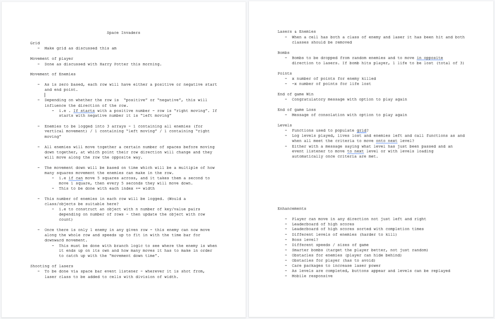


### Grid

```
const grid = document.querySelector('.grid')

const cells = []

const width = 9

for (let i = 0; i < width ** 2; i++) {
  const div = document.createElement('div')
  div.classList.add('cell')
  grid.appendChild(div)
  cells.push(div)
}
```

### Millennium Falcon

```
let mFalcon = 76

cells[mFalcon].classList.add('mFalcon')

document.addEventListener('keydown', (event) => {
  const key = event.key
  if (key === 'ArrowUp' && !(mFalcon < (width * (width - 2)))) {
    cells[mFalcon].classList.remove('mFalcon')
    mFalcon -= width
    cells[mFalcon].classList.add('mFalcon')
  } else if (key === 'ArrowDown' && (mFalcon < (width ** 2) - width)) {
    cells[mFalcon].classList.remove('mFalcon')
    mFalcon += width
    cells[mFalcon].classList.add('mFalcon')
  } else if (key === 'ArrowLeft' && !(mFalcon % width === 0)) {
    cells[mFalcon].classList.remove('mFalcon')
    mFalcon -= 1
    cells[mFalcon].classList.add('mFalcon')
  } else if (key === 'ArrowRight' && !(mFalcon % width === width - 1)) {
    cells[mFalcon].classList.remove('mFalcon')
    mFalcon += 1
    cells[mFalcon].classList.add('mFalcon')
  }
})
```

### Enemy movement

This was probably one of the more time consuming tasks as I wanted the enemies to move in opposite directions depending on the rows they were on. In order to get this to work I came up with a system whereby there is a lead square and a tail square and as these move the enemies then follow them. At the end of each line the lead becomes the tail on the next line and vise versa. I then applied some logic to check if either the lead square or the tail square was equal to the start or the end of the line in question and then applied the required functions. 


### Lasers

In order to be able to have multiple lasers I put an event listener linked to the space bar in that adds a laser to the cell directly above the Millenium Falcon wherever it is on the board. I then wrote an interval function to check every 200ms if there are any lasers on the board and to move them accordingly.


### Enemy Lasers

The enemy lasers were exactly the same concept as the lasers, with 2 fundadmental differences. First of all they obviously needed to move down the grid and not up it; and secondly, they needed to be fired randomly. I also wanted these to move at different speeds depending on which level the user was playing. 

```
  interval3 = setInterval(() => {
    const randomIndex = Math.floor(Math.random() * (arrayAllDroids.flat(Infinity).length))
    addELaser(arrayAllDroids.flat(Infinity)[randomIndex])
  }, 1000)


  interval4 = setInterval(() => {
    for (let i = 0; i < cells.length; i++) {
      if (cells[i].classList.contains('elaser') === true) {
        removeELaser(i)
        addELaser(i + width)
        mFalconHit()
        return
      }
    }
  }, 100)
```


### Scaling

The main issue with scaling was finding the begging and end of each row without having to hard code them. The formula (see below in spreadsheet) was easy enough to find - this allowed me to enter the number of columns required and get the begging and end of each row, however I couldnt find a way to replicate the formula n times - so I ended up having to hard code that part:

```
const row1Beg = (width * (1 - 1))
const row2Beg = (width * (2 - 1))
const row3Beg = (width * (3 - 1))
const row4Beg = (width * (4 - 1))
const row5Beg = (width * (5 - 1))
const row6Beg = (width * (6 - 1))
const row7Beg = (width * (7 - 1))
const row8Beg = (width * (8 - 1))
const row9Beg = (width * (9 - 1))

const row1End = ((width * (width - (width - 1))) - 1)
const row2End = ((width * (width - (width - 2))) - 1)
const row3End = ((width * (width - (width - 3))) - 1)
const row4End = ((width * (width - (width - 4))) - 1)
const row5End = ((width * (width - (width - 5))) - 1)
const row6End = ((width * (width - (width - 6))) - 1)
const row7End = ((width * (width - (width - 7))) - 1)
const row8End = ((width * (width - (width - 8))) - 1)
const row9End = ((width * (width - (width - 9))) - 1)
```

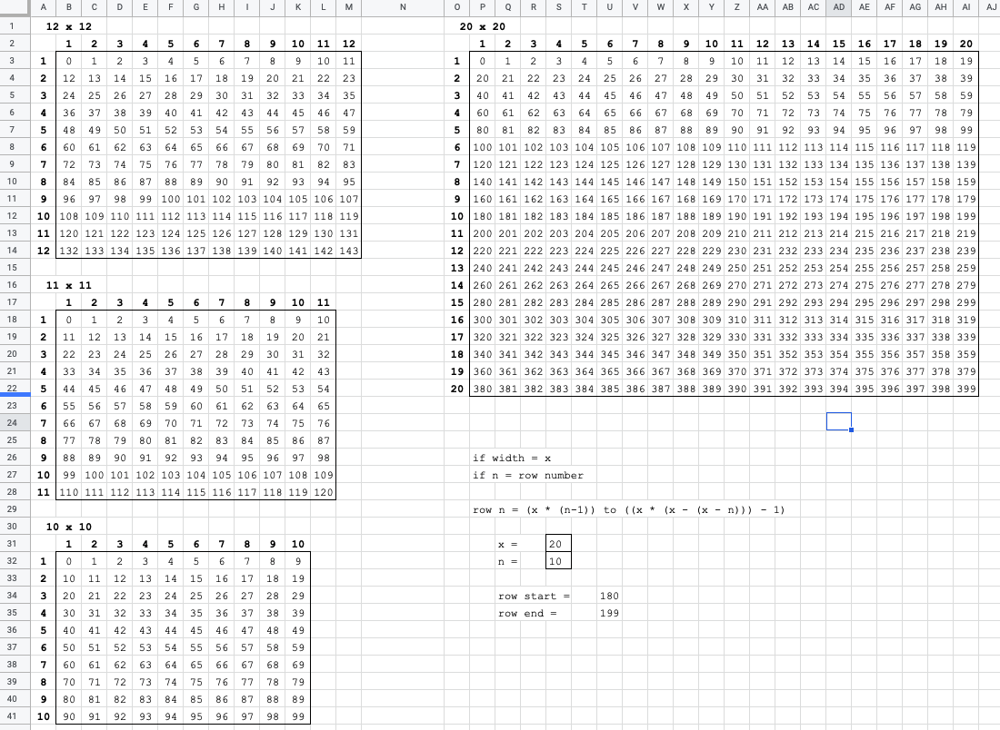


### Collisions

In order to check for collisions I wrote the following code to check (with intervals) whether at any one time the class of the element contained both a laser and any of the 'enemy' classes. If so then to remove both the laser and either change the class (if the enemy required multiple hits) or to remove the class in order to leave the cell blank.

```
function droidHit() {
  for (let i = 0; i < cells.length; i++) {
    sumDroids()
    if (cells[i].classList.contains('hit') === true && cells[i].classList.contains('laser') === true) {
      return
    } else if (cells[i].classList.contains('stormtrooper') === true && cells[i].classList.contains('laser') === true) {
      if (i >= arrayLeadsAndTails[0][0] && i <= arrayLeadsAndTails[0][1]) {
        arrayHitTroopers[0].push(i)
        delete arrayAllTroopers[0].splice([arrayAllTroopers[0].indexOf(i)], 1)
      } else if (i >= arrayLeadsAndTails[1][0] && i <= arrayLeadsAndTails[1][1]) {
        arrayHitTroopers[1].push(i)
        delete arrayAllTroopers[1].splice([arrayAllTroopers[1].indexOf(i)], 1)
      } else if (i >= arrayLeadsAndTails[2][0] && i <= arrayLeadsAndTails[2][1]) {
        arrayHitTroopers[2].push(i)
        delete arrayAllTroopers[2].splice([arrayAllTroopers[2].indexOf(i)], 1)
      } else if (i >= arrayLeadsAndTails[3][0] && i <= arrayLeadsAndTails[3][1]) {
        arrayHitTroopers[3].push(i)
        delete arrayAllTroopers[3].splice([arrayAllTroopers[3].indexOf(i)], 1)
      } else if (i >= arrayLeadsAndTails[4][0] && i <= arrayLeadsAndTails[4][1]) {
        arrayHitTroopers[4].push(i)
        delete arrayAllTroopers[4].splice([arrayAllTroopers[4].indexOf(i)], 1)
      }
      cells[i].classList.remove('stormtrooper')
      cells[i].classList.add('hitstormtrooper')
      removeLaser(i)
      laser = mFalcon
    } else if (cells[i].classList.contains('hitstormtrooper') === true && cells[i].classList.contains('laser') === true) {
      if (i >= arrayLeadsAndTails[0][0] && i <= arrayLeadsAndTails[0][1]) {
        arrayHitDroids[0].push(i)
        delete arrayHitTroopers[0].splice([arrayHitTroopers[0].indexOf(i)], 1)
        delete arrayAllDroids[0].splice([arrayAllDroids[0].indexOf(i)], 1)
      } else if (i >= arrayLeadsAndTails[1][0] && i <= arrayLeadsAndTails[1][1]) {
        arrayHitDroids[1].push(i)
        delete arrayHitTroopers[1].splice([arrayHitTroopers[1].indexOf(i)], 1)
        delete arrayAllDroids[1].splice([arrayAllDroids[1].indexOf(i)], 1)
      } else if (i >= arrayLeadsAndTails[2][0] && i <= arrayLeadsAndTails[2][1]) {
        arrayHitDroids[2].push(i)
        delete arrayHitTroopers[2].splice([arrayHitTroopers[2].indexOf(i)], 1)
        delete arrayAllDroids[2].splice([arrayAllDroids[2].indexOf(i)], 1)
      } else if (i >= arrayLeadsAndTails[3][0] && i <= arrayLeadsAndTails[3][1]) {
        arrayHitDroids[3].push(i)
        delete arrayHitTroopers[3].splice([arrayHitTroopers[3].indexOf(i)], 1)
        delete arrayAllDroids[3].splice([arrayAllDroids[3].indexOf(i)], 1)
      } else if (i >= arrayLeadsAndTails[4][0] && i <= arrayLeadsAndTails[4][1]) {
        arrayHitDroids[4].push(i)
        delete arrayHitTroopers[4].splice([arrayHitTroopers[4].indexOf(i)], 1)
        delete arrayAllDroids[4].splice([arrayAllDroids[4].indexOf(i)], 1)
      }
      cells[i].classList.remove('hitstormtrooper')
      cells[i].classList.remove('bDroid')
      cells[i].classList.add('hit')
      score += 200
      scoretally.innerHTML = score
      removeLaser(i)
      laser = mFalcon
    } else if (cells[i].classList.contains('bDroid') === true && cells[i].classList.contains('laser') === true) {
      if (i >= arrayLeadsAndTails[0][0] && i <= arrayLeadsAndTails[0][1]) {
        arrayHitDroids[0].push(i)
        delete arrayAllDroids[0].splice([arrayAllDroids[0].indexOf(i)], 1)
      } else if (i >= arrayLeadsAndTails[1][0] && i <= arrayLeadsAndTails[1][1]) {
        arrayHitDroids[1].push(i)
        delete arrayAllDroids[1].splice([arrayAllDroids[1].indexOf(i)], 1)
      } else if (i >= arrayLeadsAndTails[2][0] && i <= arrayLeadsAndTails[2][1]) {
        arrayHitDroids[2].push(i)
        delete arrayAllDroids[2].splice([arrayAllDroids[2].indexOf(i)], 1)
      } else if (i >= arrayLeadsAndTails[3][0] && i <= arrayLeadsAndTails[3][1]) {
        arrayHitDroids[3].push(i)
        delete arrayAllDroids[3].splice([arrayAllDroids[3].indexOf(i)], 1)
      } else if (i >= arrayLeadsAndTails[4][0] && i <= arrayLeadsAndTails[4][1]) {
        arrayHitDroids[4].push(i)
        delete arrayAllDroids[4].splice([arrayAllDroids[4].indexOf(i)], 1)
      }
      cells[i].classList.remove('bDroid')
      cells[i].classList.add('hit')
      score += 100
      scoretally.innerHTML = score
      removeLaser(i)
      laser = mFalcon
    }
    if (sum === 0) {
      gameWon()
      clearInterval(interval)
      clearInterval(interval2)
      clearInterval(interval3)
      clearInterval(interval4)
      clearInterval(interval5)
    }
  }
}
```
  
## Screenshots

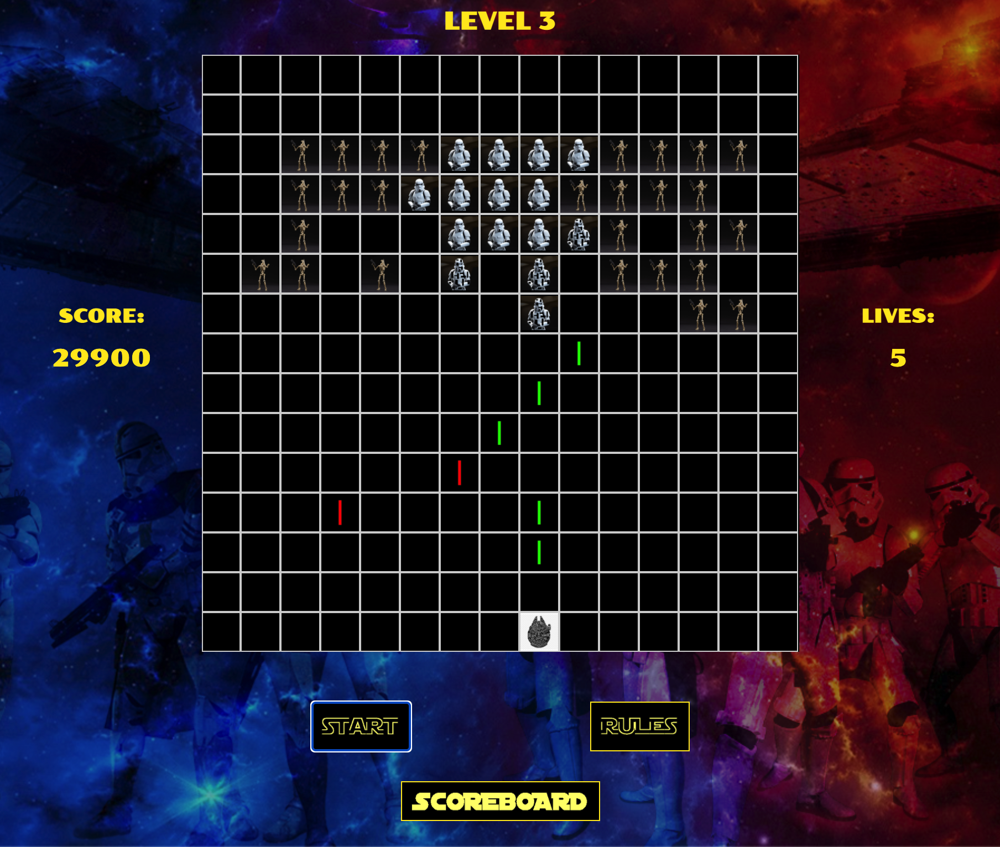
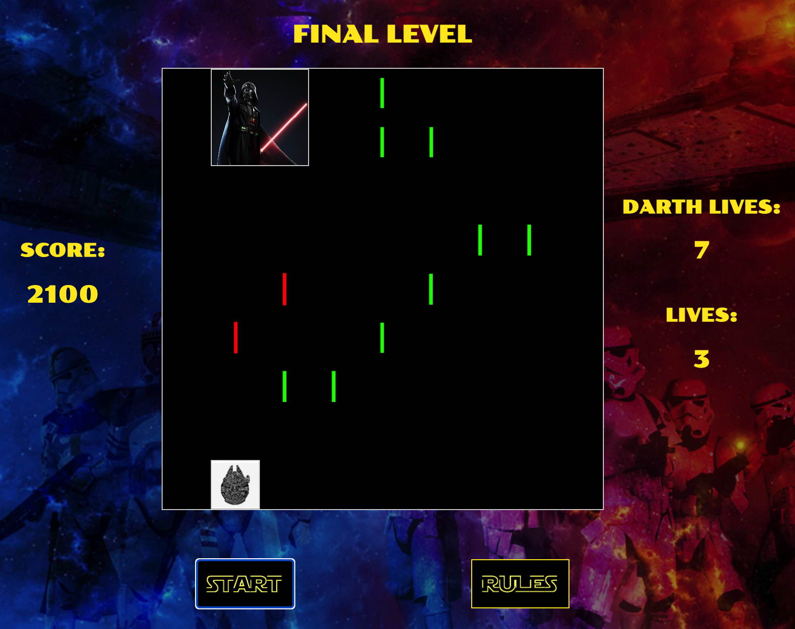 

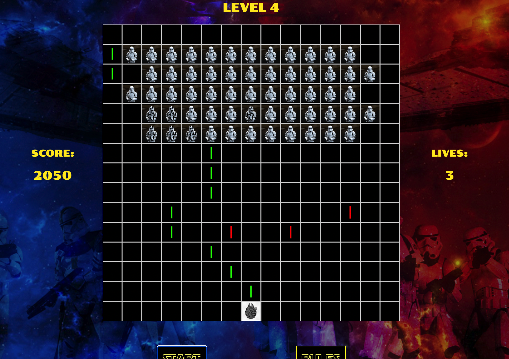 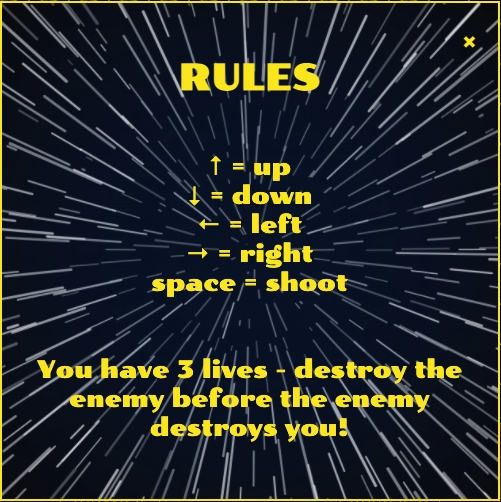 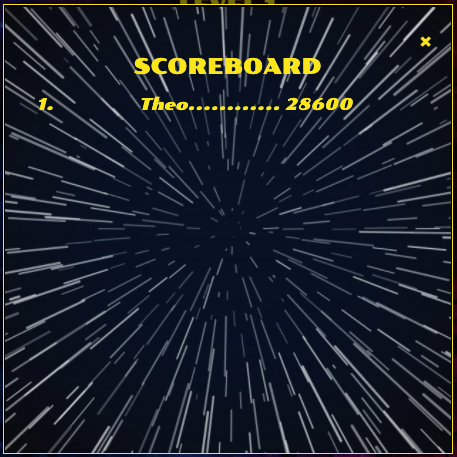

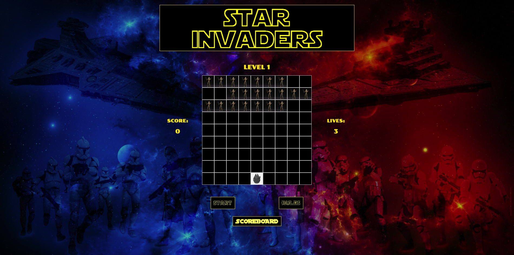 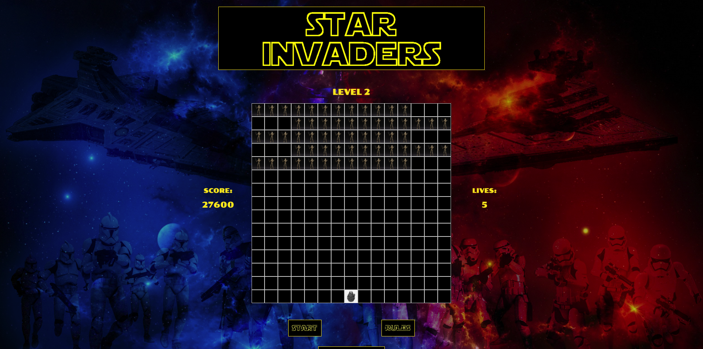  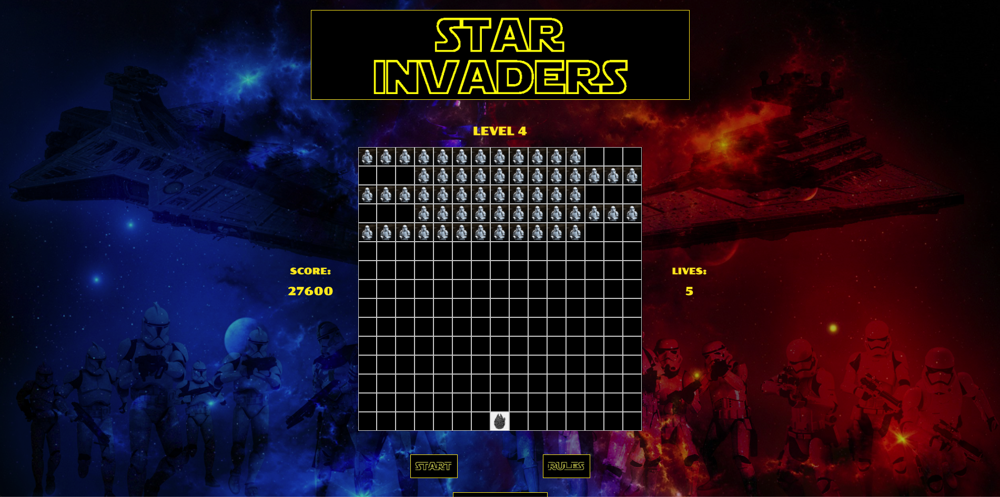 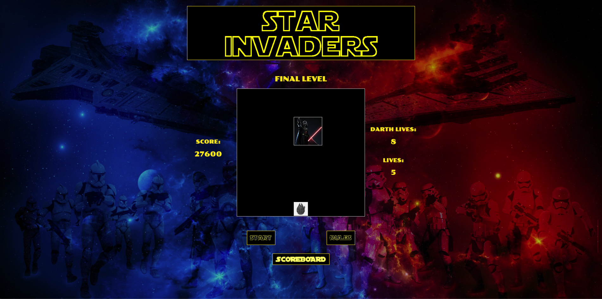


## Challenges / Victories

### Local sotrage for scores carried to different levels

I really wanted to encoorporate cross level scoring to increase the 'real game' feel of the project. Local storage seemed like the obvious way to do this. 

```
let playerScores = []
const scoreList = document.querySelector('ol')
const submit = document.querySelector('#submit-score')


if (localStorage.getItem('scores') !== null) {
  playerScores = JSON.parse(localStorage.getItem('scores'))
  orderAndDisplayScores()
}

submit.addEventListener('click', () => {
  document.querySelector('#submit-score').disabled = true
  const newName = document.querySelector('input').value
  const finalScore = Number(document.querySelector('#player-score').innerHTML)
  const player = { name: newName, score: finalScore }
  playerScores.push(player)

  if (localStorage) {
    localStorage.setItem('scores', JSON.stringify(playerScores))
  }
  orderAndDisplayScores()
})


function orderAndDisplayScores() {
  const array = playerScores
    .sort((playerA, playerB) => playerB.score - playerA.score)
    .map(player => {
      return `<li>${player.name}............            ${player.score}</li>`
    })
  scoreList.innerHTML = array.join('')
}
```

### Harder / decaying enemies

This was a feature that I really liked the idea of an probably spent too much time implementing. In order to get the 'clones' to decay I once hit for the first time, I created 2 classes for this type of enemy, one for pre-hit and the other for post-hit. And after a bit of **Paintbrush** on the original image, I had a new image to replace the old once the new class came into place. 


### Getting boss too move together 

In order to get Darth Vader to move randomly whilst keeping 'his' 4 squares together and not having them extend past the end of the grid, I had to hard code the possible squares that his first piece (top-left) could move into. And then offsetting the rest of him against this first square.

```

const possibleCells = [0, 1, 2, 3, 4, 5, 6, 7, 9, 10, 11, 12, 13, 14, 15, 16, 18, 19, 20, 21, 22, 23, 24, 25, 27, 28, 29, 30, 31, 32, 33, 34, 36, 37, 38, 39, 40, 41, 42, 43]


// * === Add/Remove Darth ===

function addDarth() {
  cells[darthPosition].classList.add('darth1')
  cells[darthPosition + 1].classList.add('darth2')
  cells[darthPosition + width].classList.add('darth3')
  cells[darthPosition + width + 1].classList.add('darth4')
  arrayDarth = [darthPosition, darthPosition + 1, darthPosition + width, darthPosition + width + 1]
}

function removeDarth() {
  cells[darthPosition + width + 1].classList.remove('darth4')
  cells[darthPosition + width].classList.remove('darth3')
  cells[darthPosition + 1].classList.remove('darth2')
  cells[darthPosition].classList.remove('darth1')
}


// * === Move Darth ===

function moveDarth() {
  removeDarth()
  darthPosition = possibleCells[Math.floor(Math.random() * possibleCells.length)]
  addDarth()
}
```

## Known bugs

* I have found on occasion that when too many lasers are fired from the M-Flacon that some of them pass through the 'enemies' - this doesnt seem to happen on every level and usually happens when there are fewer 'enemies' left on the grid.

* Although not one I have managed to replicate - a friend advised me that he managed to get the 'Darth Lives' on the final level to as low as '-66'. There was obviously something very wrong there, but as I say I have not managed to recreate this issue.


## Potential future features

Asside from fixing the bugs...


### Increased Speed

* I would have liked to have implemented code that would allow the enemies to speed up depending either on how many were left in that particular row or on how far down the grid they were.

### Mobile Responsiveness 

* I decided to spend more time developing the game rather than trying to implement mobile responsiveness. It would be a nice feature to have though and one my 'test subjects' highlighted stongly.

### Darth decaying like the 'clones'

* I think this would have been very achievable with a little more time, and probably should have tried to achieve this at the expense of one of the levels, however I got a little caught up trying to achieve a 'full game' user experience and simply ran out of time. 

## Images

* **Droid:** https://bbts1.azureedge.net/images/p/full/2019/06/12bdcb4b-4d63-4ebb-8173-10181eab20bc.jpg
* **Stormtrooper:** https://www.sideshow.com/storage/product-images/7180/stormtrooper_star-wars_feature.jpg
* **Millenium Falcon:** https://www.pikpng.com/pngl/m/30-300944_bleed-area-may-not-be-visible-millennium-falcon.png
* **Darth Vader:** https://i.pinimg.com/originals/69/91/a0/6991a0ffe7fe44110d20a45793e4a5b8.jpg
